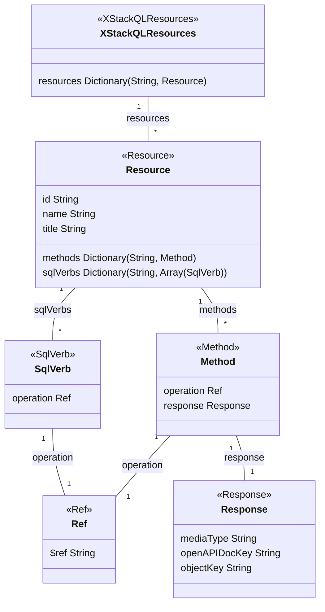

# StackQL Resources README

StackQL utilizes a concept of `resources` that are defined within the `x-stackQL-resources` component. Each `resource` represents a specific `service` endpoint provided by the provider's service as described by their OpenAPI spec.

## Structure

Here's a basic ASCII tree representing the structure of a `resource`:

```plaintext
x-stackQL-resources
└── Resource (e.g., "users")
    ├── Methods
    │   ├── Method 1 (e.g., "list")
    │   │   ├── Operation (points to path & verb in OpenAPI document)
    │   │   └── Response (describes the expected response)
    │   │       ├── mediaType
    │   │       ├── openAPIDocKey
    │   │       └── objectKey
    │   ├── Method 2 (e.g., "insert")
    │   │   ├── Operation
    │   │   └── Response
    │   │       ├── mediaType
    │   │       ├── openAPIDocKey
    │   │       └── objectKey
    │   └── ...
    └── SQL Verbs
        ├── select
        │   └── Reference to methods
        ├── insert
        │   └── Reference to methods
        └── delete
            └── Reference to methods
```

below is a class diagram representing the resources structure:



## Detailed Description

Each `resource` consists of multiple `methods` and `sqlVerbs`.

- `methods`: Each method corresponds to a specific operation on the resource. For example, methods could be "list", "insert", "delete", etc. Each method contains:
    - An `operation` that points to the corresponding operation in the provider's OpenAPI document. The operation is defined by a unique combination of path and verb (also known as `operationId`).
    - A `response` which describes the expected format of the response from the operation. This includes `mediaType`, `openAPIDocKey`, and `objectKey`. The `objectKey` uses JSONPath syntax to point to the specific field in the response data that needs to be unmarshaled.

- `sqlVerbs`: These are standard SQL verbs (like `select`, `insert`, `delete`, etc.) that are mapped to methods. If a method isn't referenced by any of the `sqlVerbs`, it can still be accessed using the `exec` verb.

By linking SQL verbs to specific methods of a resource, StackQL allows a more intuitive and SQL-like interaction with the OpenAPI described services. 

For more information, please refer to our [OpenAPI spec documentation](link-to-documentation).
